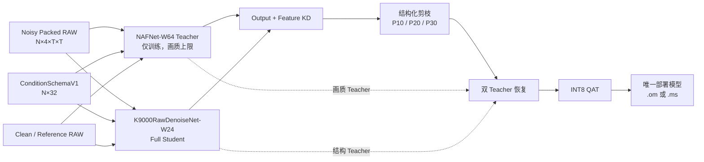
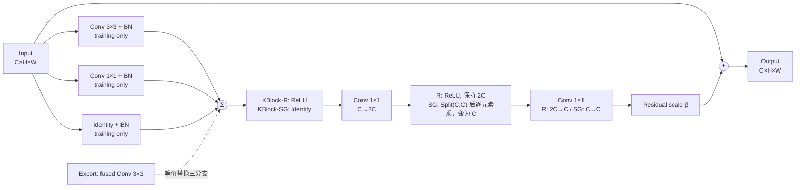
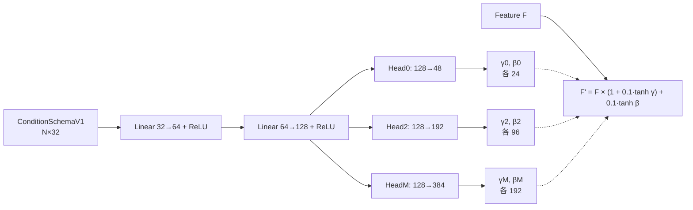
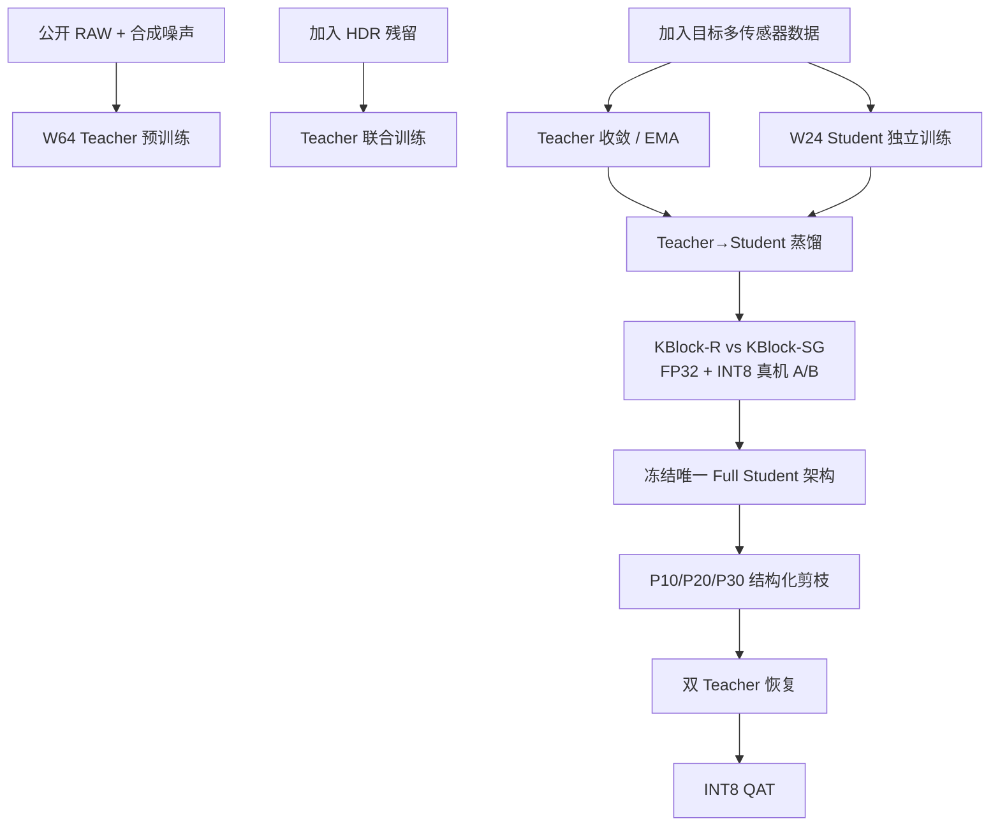
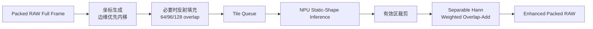
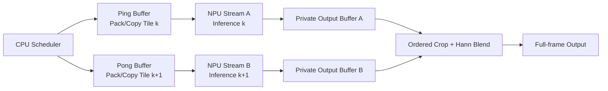

# AI ISP RAW 降噪增强模块详细开发设计 V1.0

> 目标平台：麒麟 9000 系列终端（具体 NPU 能力以目标设备固件实测为准）  
> 业务定位：单帧 RAW / HDR Fusion 后 RAW / 多摄逐摄 RAW 降噪增强  
> 当前状态：商业立项与工程实现基线  
> 上位基线：[AI ISP 量产设计基线 V18.0](./AI%20ISP量产设计基线%20V18.0.md)  
> 文档原则：本文给出可执行设计与验收门槛；未取得目标设备数据前，性能数值均作为工程门槛，不作为已达成声明。

---

## 0. 执行摘要

本项目采用“高容量 Teacher 建立画质上限、NPU 原生轻量 Student 单模型部署、蒸馏、强制结构化剪枝、QAT、Tile A/B 实测选型”的路线。

|项目|冻结结论|
|---|---|
|模型输入|`N×4×H×W` Packed RAW，`H=Hraw/2`，`W=Wraw/2`|
|模型输出|同尺寸 4 通道线性 RAW 残差增强结果|
|Teacher|NAFNet-W64，仅训练和蒸馏使用|
|部署 Student|`K9000RawDenoiseNet-W24`，约 3.03M 参数的工程预算结构|
|部署权重|全场景、全摄像头共用一套权重；场景差异通过 Conditioning 表达|
|部署算子|以 `Conv 3×3/1×1 + Add + FiLM + Nearest Resize` 为主；ReLU 与轻量 SimpleGate 在 P3 真机 A/B 后二选一|
|剪枝|必要流程；P10/P20/P30 三档真实结构化通道剪枝，最低必须达到 P10|
|量化|剪枝完成后执行 INT8 QAT；不允许以未剪枝模型直接量产|
|Tile|`512×512` 与 `1024×1024` 在目标机 A/B；按端到端 P95、内存和功耗选型|
|首发分辨率|12MP 与 50MP 均为硬性验收范围|
|质量原则|保真优先；禁止通过高权重感知/GAN Loss 生成不受 RAW 支持的纹理|
|项目周期|32–36 周，建议 6–10 人|

### 0.1 关键设计变化

与 V18.0 的标准 NAFNet-W32 部署设想相比，本文将部署 Student 调整为 NPU 原生结构：

- NAFNet-W64 保留为画质 Teacher；
- Student 去除 LayerNorm、SCA/全局池化和 PixelShuffle 等潜在部署风险点；
- 激活 Block 同时实现 `KBlock-R`（ReLU）与 `KBlock-SG`（轻量 SimpleGate）候选，在同等训练和量化条件下真机 A/B，P3 结束只冻结其中一种；
- 使用标准 3×3/1×1 卷积、Add 和最近邻上采样；
- 训练期多分支 Block 在导出前重参数化为单个 3×3 卷积；
- 仍保留 U-Net 多尺度、Skip、RAW 残差输出与 Conditioning FiLM；
- 只交付一个最终 Student 权重，不为 12MP/50MP、摄像头或场景复制模型。

这一调整基于端侧 NPU 的工程事实：算子是否完整下沉、内存访问和编译图形态，通常比单纯参数量或理论 MACs 更能决定时延。NAFNet 论文和官方实现用于建立 Teacher；Student 则按目标 NPU 原生算子重新设计。

---

## 1. 商业目标、范围与验收口径

### 1.1 产品目标

在 ISP Pipeline 的线性 RAW 阶段，对噪声、固定图样噪声、坏点残留、HDR Fusion 残留和轻度颜色/增益误差进行抑制，同时保持真实边缘、细纹理、高光和暗部色彩，为后续 Demosaic、AWB、CCM、Tone Mapping 和 Sharpen 提供更干净的输入。

### 1.2 模块边界

模块负责：

- Single RAW 降噪增强；
- HDR Fusion 后 RAW 残留噪声与轻度融合伪影抑制；
- 主摄、超广角、长焦等 RAW 的逐摄独立增强；
- 通过 Conditioning 适配曝光、增益、噪声模型、场景和传感器；
- Tile 切分、反射填充、有效区裁剪与 Hann 加权融合。

模块不负责：

- HDR/MFNR Fusion 本身；
- 跨摄像头配准或融合；
- 首版独立 AI Demosaic；
- JPEG 编码、显示域 Tone Mapping 或锐化；
- 恢复上游已经饱和、错误融合或完全丢失的信息。

### 1.3 端到端范围

性能计时从“Packed RAW 输入和 Conditioning 已就绪”开始，到“增强后的 Packed RAW 输出可供下游读取”为止，包含 Tile 调度、NPU 推理、裁剪和融合，不包含传感器读出、HDR Fusion、Demosaic、JPEG 和文件 I/O。

### 1.4 首发硬门槛

|类别|硬门槛|目标值|冲刺值|
|---|---:|---:|---:|
|12MP 端到端 P50|≤ 350 ms|≤ 280 ms|≤ 220 ms|
|12MP 端到端 P95|≤ 500 ms|≤ 350 ms|≤ 250 ms|
|50MP 端到端 P50|≤ 1300 ms|≤ 950 ms|≤ 700 ms|
|50MP 端到端 P95|≤ 1800 ms|≤ 1200 ms|≤ 900 ms|
|峰值工作内存|≤ 512 MB|≤ 384 MB|—|
|INT8 模型包|≤ 12 MB|≤ 8 MB|—|
|NPU 算子覆盖|100%，无未批准 CPU/GPU 回退|100%|100%|
|连续稳定性|12MP 连拍 30 张、50MP 连拍 10 张无崩溃/OOM|同左|同左|
|持续负载退化|热稳态 P95 相对冷态退化 ≤ 20%|≤ 15%|≤ 10%|

上述时延是采用 P20 级剪枝、INT8、Tile 流水和有效并行后的商业立项门槛，不是当前已测结论。相比初始串行预算，12MP P95 从 800ms 收紧为 500ms，50MP P95 从 3000ms 收紧为 1800ms。移动端公开研究显示，网络结构、算子兼容性和芯片代际会产生很大的运行差异，因此必须在目标机上冻结最终值；若硬门槛未达到，不能以“支持并行”作为通过理由。

---

## 2. 商业开发阶段

建议团队为 6–10 人：算法 3 人、数据/训练 1–2 人、Camera/ISP 1 人、NPU/端侧 1–2 人、测试 1 人、项目/架构 1 人。部分角色可兼任，但 NPU 集成和 Camera 数据闭环必须有明确负责人。

|阶段|周期|关键输入|主要工作|必须输出|数值退出条件|
|---|---:|---|---|---|---|
|P0 需求/IP/设备冻结|2 周|产品需求、目标机、Camera 清单、许可证清单|冻结范围、接口、竞品、IP、数据合规、目标固件|PRD、接口草案、风险清单、测试机矩阵|12MP/50MP、场景、摄像头、固件和责任人 100% 明确；第三方许可证 100% 评审|
|P1 CPU 工程 PoC|4 周|V18 基线、公开 RAW、小网络|Bayer Pack/Unpack、归一化、Condition、噪声合成、Tile、ONNX、剪枝小样|可运行 CPU Pipeline、单测、静态 ONNX|核心单测通过率 100%；Pack/Unpack 最大误差 0；Tile 恒等模型最大误差 ≤ `1e-6`|
|P2 数据与噪声标定|6 周|目标传感器、暗场/平场/静态 Burst、公开数据|数据采集、配准、坏帧剔除、噪声拟合、划分、防泄漏|Dataset V1、Sensor Profile、Data Card|每摄像头训练/验证/盲测 ≥ 3000/300/500 场景；噪声拟合 `R²≥0.95`；泄漏 0|
|P3 Teacher/Student FP32|6–8 周|Dataset V1、训练集群|W64 Teacher、W24 独立训练、消融、全分辨率验证|Teacher、Full Student、评测报告|Student 相对 Teacher RAW PSNR 下降 ≤ 0.30 dB；各场景无灾难性退化；ONNX 数值误差 ≤ `1e-4`|
|P4 蒸馏/剪枝/QAT|6–8 周|Teacher、Full Student、校准集|蒸馏、P10/P20/P30、恢复训练、PTQ、QAT|三档候选、Final Pruned FP32、INT8 Q/DQ ONNX|蒸馏差距 ≤ 0.15 dB；剪枝额外下降 ≤ 0.10 dB；INT8 额外下降 ≤ 0.10 dB；最低 P10|
|P5 Camera 数据闭环|6 周，可与 P4 重叠|目标机 RAW、ISP Reference、主观样张|传感器回归、HDR/多摄适配、色彩与暗部问题修正|Dataset V2、Final Sensor Profile、Blind Report|每摄像头/模式均过独立盲测；平均 `ΔE00≤1.0`、P95 `≤2.0`；坏点/条纹无新增可见回归|
|P6 麒麟 9000 集成|6 周|INT8 模型、DDK/SDK、目标固件|模型转换、静态 Shape、Tile A/B、内存复用、异步流水、回退审计|`.om` 或 `.ms`、端侧库、性能报告|达到 1.4 全部门槛；CPU/GPU 非批准回退为 0；512/1024 Tile 完成等条件 A/B|
|P7 DVT/PVT 与发布|4 周|Release Candidate、量产固件、测试矩阵|压力、温升、异常输入、回滚、签名、版本冻结|Release 包、Model Card、回滚包、量产报告|阻断级缺陷 0；高优缺陷 0；完整矩阵通过率 100%；可回滚验证通过|

总排期为 32–36 周。若目标硬件、固件接口或配对 RAW 数据晚于 P1 到位，项目周期从依赖实际到位日顺延，不用压缩 P5/P6 验证窗口补偿。

### 2.1 各阶段交付物命名

```text
artifacts/
├── teacher/nafnet_w64_fp32_<data_version>.pth
├── student/k9000_raw_w24_full_fp32_<run_id>.pth
├── student/k9000_raw_w24_distilled_fp32_<run_id>.pth
├── pruning/p10|p20|p30/model_fp32.onnx
├── release/model_pruned_fp32.onnx
├── release/model_int8_qdq.onnx
├── release/model.om | model.ms
├── release/model_manifest.json
├── release/condition_schema_v1.json
└── reports/quality_performance_release_<version>.md
```

---

## 3. 输入、输出与 Conditioning 接口

### 3.1 Bayer 与 Packed RAW

原始 Bayer：

```text
RawBayer: N × 1 × Hraw × Wraw
```

模型图像输入：

```text
PackedRAW: N × 4 × (Hraw/2) × (Wraw/2)
```

RGGB 的固定通道顺序为 `[R, Gr, Gb, B]`。BGGR、GRBG、GBRG 必须先按照 `cfa_pattern` 重排到同一语义顺序，禁止让网络自行猜测 CFA。

|标称分辨率|原始 Bayer|Packed RAW|
|---|---|---|
|12MP|`4000×3000`|`4×2000×1500`|
|50MP|`8192×6144`|`4×4096×3072`|

每通道归一化：

```text
x_c = clamp((raw_c - black_c) / (white_level - black_c), 0, 1)
```

Black Level 为每通道独立值；White Level 为当前模式的统一值。进入模型前必须完成坏元数据检查、奇数边界处理和 CFA 语义重排。

### 3.2 图像输入和输出

```text
Image Input : FP16/FP32/INT8, N×4×T×T
Condition   : FP32, N×32
Residual   : N×4×T×T
Enhanced   : clamp(Image Input + Residual, 0, 1)
```

主图像输入始终只有 4 个 RAW 语义通道。曝光、增益、噪声和场景信息不得拼进图像通道；它们通过独立 Conditioning 输入进入模型。

### 3.3 ConditionSchemaV1

Condition 张量固定为 `FP32[N,32]`，模型值全部归一化到 `[0,1]`。以下示例对应：12-bit、HDR Fused RAW、主摄、Sensor Profile 0、曝光 `1/30 s`、模拟增益 `8×`、数字增益 `1.25×`。

噪声参数定义为归一化 RAW 域：

```text
variance_c(x) = shot_c × x + read_c
```

|索引|名称|原始格式/范围|归一化方法|具体输入示例|模型值示例|
|---:|---|---|---|---:|---:|
|0|exposure_time_s|float，`[1/16000, 30] s`|`(log2(t)-log2(1/16000))/log2(16000)`|`0.033333`|`0.648649`|
|1|analog_gain|float，`[1,64]×`|`log2(g)/6`|`8.0`|`0.500000`|
|2|digital_gain|float，`[1,8]×`|`log2(g)/3`|`1.25`|`0.107309`|
|3|shot_R|float，`[1e-5,1e-1]`|`(log10(a)+5)/4`|`0.00120`|`0.519795`|
|4|shot_Gr|同上|同上|`0.00105`|`0.505297`|
|5|shot_Gb|同上|同上|`0.00106`|`0.506326`|
|6|shot_B|同上|同上|`0.00130`|`0.528486`|
|7|read_R|float，`[1e-8,1e-3]`|`(log10(b)+8)/5`|`2.5e-6`|`0.479588`|
|8|read_Gr|同上|同上|`2.0e-6`|`0.460206`|
|9|read_Gb|同上|同上|`2.1e-6`|`0.464444`|
|10|read_B|同上|同上|`2.8e-6`|`0.489432`|
|11|black_R|integer DN|`black/(2^bit-1)`|`256`|`0.062515`|
|12|black_Gr|integer DN|同上|`256`|`0.062515`|
|13|black_Gb|integer DN|同上|`256`|`0.062515`|
|14|black_B|integer DN|同上|`256`|`0.062515`|
|15|white_level|integer DN|`white/(2^bit-1)`|`4095`|`1.000000`|
|16|fusion_confidence|float，`[0,1]`|直接使用|`0.92`|`0.920000`|
|17|motion_score|float，`[0,1]`|直接使用|`0.18`|`0.180000`|
|18|ghost_score|float，`[0,1]`|直接使用|`0.07`|`0.070000`|
|19|scene_single|one-hot|直接使用|`0`|`0.0`|
|20|scene_hdr_fused|one-hot|直接使用|`1`|`1.0`|
|21|scene_multi_cam_single|one-hot|直接使用|`0`|`0.0`|
|22|camera_main|one-hot|直接使用|`1`|`1.0`|
|23|camera_ultrawide|one-hot|直接使用|`0`|`0.0`|
|24|camera_tele|one-hot|直接使用|`0`|`0.0`|
|25|camera_other|one-hot|直接使用|`0`|`0.0`|
|26|sensor_profile_0|one-hot|直接使用|`1`|`1.0`|
|27|sensor_profile_1|one-hot|直接使用|`0`|`0.0`|
|28|sensor_profile_2|one-hot|直接使用|`0`|`0.0`|
|29|sensor_profile_other|one-hot|直接使用|`0`|`0.0`|
|30|metadata_valid|bool|`false/true→0/1`|`true`|`1.0`|
|31|enhancement_strength|float，`[0,1]`|直接使用|`0.80`|`0.800000`|

完整示例：

```text
[0.648649, 0.500000, 0.107309,
 0.519795, 0.505297, 0.506326, 0.528486,
 0.479588, 0.460206, 0.464444, 0.489432,
 0.062515, 0.062515, 0.062515, 0.062515, 1.000000,
 0.920000, 0.180000, 0.070000,
 0.0, 1.0, 0.0,
 1.0, 0.0, 0.0, 0.0,
 1.0, 0.0, 0.0, 0.0,
 1.0, 0.800000]
```

### 3.4 缺省与异常策略

- Single RAW 的 `fusion_confidence/motion_score/ghost_score=[1,0,0]`；
- 物理元数据缺失时从 Sensor Profile 填默认值，并设置 `metadata_valid=0`；
- 未知摄像头置 `camera_other=1`，未知传感器置 `sensor_profile_other=1`；
- `enhancement_strength` 默认 `1.0`；
- log 归一化前先 Clamp 到声明范围，禁止 `NaN/Inf` 进入网络；
- Manifest 必须带 `condition_schema_version=1`；版本不匹配时拒绝调用并走可控 Bypass，不静默猜测字段。

---

## 4. 网络模型结构

### 4.1 总体训练—部署关系



### 4.2 Teacher：NAFNet-W64

Teacher 沿用 NAFNet 的多尺度 Encoder–Middle–Decoder 与残差输出，宽度为 64：

```text
Encoder blocks: [2, 2, 6, 8]
Middle blocks : 4
Decoder blocks: [2, 2, 2, 2]
Base width    : 64
```

Teacher 使用标准 NAFBlock 中的 LayerNorm、SimpleGate、SCA 和残差缩放参数，建立 FP32 画质上限，不作为麒麟 9000 的部署结构。标准实现主体约 57.93M 参数，最终准确值必须由锁定实现的参数统计脚本生成。

### 4.3 部署 Student 总体图

下图是本项目的论文风格主结构图。`T` 为 Packed RAW Tile 边长；黄色语义由 Mermaid 主题决定，因此正式评审只以节点文字和连线为准。

```mermaid
flowchart LR
    X["Packed RAW<br/>4×T×T"] --> I["Intro Conv 3×3<br/>24×T×T"]
    I --> E0["Encoder Stage 0<br/>2× KBlock<br/>24×T×T"]
    E0 --> D0["Down 3×3, s=2<br/>48×T/2×T/2"]
    D0 --> E1["Encoder Stage 1<br/>2× KBlock<br/>48×T/2×T/2"]
    E1 --> D1["Down 3×3, s=2<br/>96×T/4×T/4"]
    D1 --> E2["Encoder Stage 2<br/>4× KBlock<br/>96×T/4×T/4"]
    E2 --> D2["Down 3×3, s=2<br/>192×T/8×T/8"]
    D2 --> M["Middle<br/>6× KBlock<br/>192×T/8×T/8"]

    M --> U2["Nearest ↑2 + Conv 3×3<br/>96×T/4×T/4"]
    E2 -- "Skip Add" --> A2(("+"))
    U2 --> A2 --> R2["Decoder Stage 2<br/>2× KBlock<br/>96×T/4×T/4"]

    R2 --> U1["Nearest ↑2 + Conv 3×3<br/>48×T/2×T/2"]
    E1 -- "Skip Add" --> A1(("+"))
    U1 --> A1 --> R1["Decoder Stage 1<br/>2× KBlock<br/>48×T/2×T/2"]

    R1 --> U0["Nearest ↑2 + Conv 3×3<br/>24×T×T"]
    E0 -- "Skip Add" --> A0(("+"))
    U0 --> A0 --> R0["Decoder Stage 0<br/>2× KBlock<br/>24×T×T"]

    R0 --> O["Ending Conv 3×3<br/>Residual 4×T×T"]
    X -- "RAW long skip" --> SUM(("+"))
    O --> SUM --> Y["Enhanced RAW<br/>4×T×T"]

    C["Condition<br/>32"] --> CE["Condition Encoder<br/>32→64→128"]
    CE -. "FiLM 24ch" .-> E0
    CE -. "FiLM 96ch" .-> E2
    CE -. "FiLM 192ch" .-> M
```



### 4.4 Student 逐层定义

|序号|模块|输入 Shape|输出 Shape|重复|导出算子|
|---:|---|---|---|---:|---|
|0|Intro Conv|`N×4×T×T`|`N×24×T×T`|1|Conv 3×3|
|1|Encoder Stage 0|`N×24×T×T`|同左|2|KBlock|
|2|Down 0|`N×24×T×T`|`N×48×T/2×T/2`|1|Conv 3×3 s2|
|3|Encoder Stage 1|`N×48×T/2×T/2`|同左|2|KBlock|
|4|Down 1|`N×48×T/2×T/2`|`N×96×T/4×T/4`|1|Conv 3×3 s2|
|5|Encoder Stage 2|`N×96×T/4×T/4`|同左|4|KBlock|
|6|Down 2|`N×96×T/4×T/4`|`N×192×T/8×T/8`|1|Conv 3×3 s2|
|7|Middle|`N×192×T/8×T/8`|同左|6|KBlock|
|8|Up 2|`N×192×T/8×T/8`|`N×96×T/4×T/4`|1|Nearest Resize + Conv 3×3|
|9|Skip/Decoder 2|`N×96×T/4×T/4`|同左|2|Add + KBlock|
|10|Up 1|`N×96×T/4×T/4`|`N×48×T/2×T/2`|1|Nearest Resize + Conv 3×3|
|11|Skip/Decoder 1|`N×48×T/2×T/2`|同左|2|Add + KBlock|
|12|Up 0|`N×48×T/2×T/2`|`N×24×T×T`|1|Nearest Resize + Conv 3×3|
|13|Skip/Decoder 0|`N×24×T×T`|同左|2|Add + KBlock|
|14|Ending Conv|`N×24×T×T`|`N×4×T×T`|1|Conv 3×3|
|15|RAW Residual|输入 + 预测残差|`N×4×T×T`|1|Add + Clamp（Clamp 可在图外）|

工程预算：Full Student 约 3.03M 参数；512 Tile 约 37.82 GMAC，1024 Tile 约 151.30 GMAC。该数值用于立项估算，最终以锁定 ONNX 对固定 Shape 的图级 profiler 结果为发布值。

### 4.5 KBlock：训练态、部署态与 SimpleGate 决策

KBlock 采用训练期多分支、部署期重参数化的残差结构，形式类似移动端常见的 Rep-style Block，但不依赖自定义算子。空间混合部分对两种候选完全一致；通道混合/激活部分在 P3 进行一次性架构 A/B。



部署前将 `3×3+BN`、补零后的 `1×1+BN` 和 `Identity+BN` 融合为单个 3×3 Conv。融合后必须满足：

```text
max_abs(training_eval_output - fused_output) ≤ 1e-5  (FP32)
```

`β` 初始化为 0，训练中逐渐学习残差幅度。若目标 DDK 对显式标量乘法产生回退，可在导出时将 `β` 融合进后一层卷积权重。

两种候选的定义：

- `KBlock-R`：两个 ReLU，算子兼容性和量化稳定性优先；
- `KBlock-SG`：保留 NAFNet 的核心门控思想，但不照搬 LayerNorm、Depthwise Conv 和 SCA；`Conv1×1(C→2C)` 后按通道二分为 `x1/x2`，计算 `x1⊙x2`，再用 `Conv1×1(C→C)` 投影；
- `KBlock-SG` 的 Split 必须导出为静态 Slice/View，逐元素 Mul 必须完全落在 NPU；
- A/B 使用相同宽度、Block 数、数据、训练步数、蒸馏 Teacher、剪枝率和 INT8 配置；
- 质量优先级为 RAW PSNR/SSIM、RGB `ΔE00` 和暗部纹理；工程优先级为 NPU 覆盖、端到端 P95、峰值内存和功耗；
- 若两者画质差 `<0.05 dB`，选择 P95 更低者；若 P95 差 `<10%`，选择峰值内存/功耗更低者；仍相同则选择 `KBlock-R`；
- 该比较只用于架构冻结，发布包中不得同时携带两个 Student 权重。

### 4.6 Conditioning 与 FiLM



FiLM 分别注入 Encoder Stage 0、Encoder Stage 2 和 Middle 的首个 Block 前。离散 one-hot 和连续物理量共用 Condition Encoder；语义输入的 32 维不得参与剪枝。FiLM Head 的输出通道必须随对应特征通道同步裁剪。

### 4.7 算子白名单与单算子门禁

|算子|要求|
|---|---|
|Conv 3×3/1×1|必须 NPU 下沉；权重 INT8 per-channel|
|ReLU|`KBlock-R` 必须融合或 NPU 下沉|
|Static Slice + Mul|`KBlock-SG` 必须 NPU 下沉；不允许动态 Split|
|Add/Mul|必须 NPU 下沉；常量缩放尽量融合进 Conv|
|Nearest Resize|必须验证静态 2×；失败则替换为等价可支持上采样结构|
|Linear|Condition 分支允许以 1×1 Conv/MatMul 表达，必须 NPU 下沉|
|Clamp|优先图外执行；若入图必须验证 NPU 覆盖|

在 P1 和 P6 分别执行两次门禁：算子级最小 ONNX 转换测试，以及完整图编译/运行时落点审计。任何未批准的 CPU/GPU 回退都视为发布阻断问题。

---

## 5. 数据、噪声模型与训练样本

### 5.1 数据组成

正式训练数据由四部分组成：

1. 公开 RAW/真实噪声数据，用于建立通用纹理和噪声先验；
2. Clean RAW 加物理噪声合成，用于覆盖曝光/增益/传感器组合；
3. 目标设备配对数据，用于 Sensor Profile 和量产收敛；
4. HDR Fusion 残留与异常数据，用于提高上游非理想输入的稳健性。

公开数据只用于预训练和方法验证，量产验收必须使用与训练集隔离的目标设备盲测数据。MIDD 公开研究包含来自 20 种移动传感器的大规模噪声/无噪声样本，可用于多传感器泛化设计参考，但不能替代目标传感器标定。

### 5.2 目标设备最小数据量

|数据类型|每摄像头/模式最低要求|用途|
|---|---:|---|
|自然场景训练/验证/盲测|3000 / 300 / 500 个原始场景|主体训练与独立验收|
|HDR 训练/验证/盲测|2000 / 200 / 300 个序列|HDR 残留适配|
|暗场|每 ISO/曝光/温度组合 ≥ 64 帧|Read noise、行列噪声、热噪声|
|平场|每档照度/增益 ≥ 32 帧|Shot noise、PRNU、通道增益|
|静态 Clean Burst|每场景 16–32 帧|配准平均生成近似 Clean Reference|
|坏点/饱和/极暗专项|每类 ≥ 200 个场景|边界和失败模式|

“场景”按原始 Capture/序列计数，不按裁剪 Patch 计数。训练、验证和测试必须在原始场景 ID 和拍摄序列层划分；同一场景的不同裁剪、曝光或 Burst 帧不得跨集合。

### 5.3 物理噪声合成

基础异方差噪声：

```text
y = Poisson(x / a) × a + Normal(0, b)
variance(y | x) ≈ a×x + b
```

其中 `a` 为 Shot Noise 系数，`b` 为 Read Noise 方差，并以 4 通道 Conditioning 同步输入。合成管线还必须随机加入：

- ADC/量化噪声；
- Row/Column Noise 与低频 Banding；
- Black Level 漂移和温度漂移；
- PRNU、通道增益误差和轻度 Lens Shading 残差；
- Hot/Dead/Stuck Pixel 与坏点簇；
- 轻度压缩/截断误差；
- 不同 Bayer 位深、Black/White Level 和 CFA。

噪声参数的采样分布不能只用均匀分布。60% 样本从目标 Sensor Profile 经验分布采样，25% 在标定范围边界增强，15% 采样超出标定范围 10%–20% 作为 OOD 稳健性训练。

### 5.4 HDR Fusion 残留模拟

HDR Fused RAW 额外模拟：

- 局部饱和和高光截断；
- 运动区域错位、双边缘和局部 Ghost；
- 不同曝光噪声不连续；
- Fusion Confidence 退化；
- 局部色偏和 Black Level 不一致；
- 上游融合权重错误造成的纹理变软或噪声突变。

运动、Ghost 和 Fusion Confidence 必须与 Conditioning 的 16–18 维保持因果一致，禁止图像退化和元数据随机互相矛盾。

### 5.5 Patch 与 CFA 增强

训练先用 Packed RAW `256×256` Patch 收敛，再用 `512×512` 扩大感受野；Teacher 最后增加少量 `1024×1024` 或等效梯度累积微调。旋转和翻转必须同步重排 `[R,Gr,Gb,B]`，尤其要正确处理 `Gr/Gb` 交换。

禁止的增强：随意 Hue/Saturation 变换、破坏线性 RAW 的 Gamma、未经元数据同步的曝光变化、把同一 Clean Target 与不一致的噪声参数配对。

---

## 6. Loss 体系

### 6.1 Ground Truth Loss

定义：

```text
Lgt = 1.00 × Lraw_nw_charb
    + 0.20 × Lraw_grad
    + 0.50 × Lrgb_charb
    + 0.10 × (1 - MS-SSIMrgb)
    + 0.02 × Lperceptual
    + 0.05 × Ltile
```

`Lraw_nw_charb` 为噪声加权 Charbonnier：

```text
sigma²_c = shot_c × target_c + read_c
w_c      = stop_grad(1 / sqrt(sigma²_c + 1e-6))
w_c      = clamp(w_c / mean(w), 0.25, 4.0)
Lraw_nw_charb = mean(sqrt((w_c × (pred_c-target_c))² + 1e-6))
```

权重归一化和 Clamp 防止暗部极小方差让梯度失控。

梯度项：

```text
Lraw_grad = Charb(Sobel_x(pred)-Sobel_x(target))
          + Charb(Sobel_y(pred)-Sobel_y(target))
```

RGB 约束使用固定、可微、非学习的 Demosaic + 简化 ISP：Black/White 还原、Demosaic、固定 WB/CCM、线性到 sRGB 映射。该支路仅用于训练，不进入部署模型。感知 Loss 只在固定渲染 RGB 上计算，权重保持 0.02，不使用 GAN Loss。

### 6.2 Tile 一致性 Loss

```text
Loverlap = mean_valid(|crop(Ytile_A) - crop(Ytile_B)|)
Lfull    = mean_valid(|Ytiled - stop_grad(Yfull)|)
Ltile    = 0.6 × Loverlap + 0.4 × Lfull
```

填充区、感受野无效边界和饱和 Ground Truth 无效区不参与计算。训练时 70% 使用 64 像素 Overlap，20% 使用 96，10% 使用 128，以避免模型只适应单一边界位置。

### 6.3 分项归一化与记录

所有 Loss 在加权前按有效元素数归一化。每个训练 Step 至少记录 `Lraw/Lgrad/Lrgb/Lssim/Lperceptual/Ltile`、四通道 PSNR、梯度范数、学习率和 Conditioning 分布；不得只记录总 Loss。

---

## 7. 训练与蒸馏

### 7.1 正式训练顺序



### 7.2 优化器与默认超参数

|项目|Teacher W64|Student W24 独立|蒸馏|剪枝恢复|QAT|
|---|---:|---:|---:|---:|---:|
|优化器|AdamW|AdamW|AdamW|AdamW|AdamW|
|初始 LR|`2e-4`|`2e-4`|`1e-4`|`5e-5`|`1e-5`|
|Weight decay|`1e-4`|`1e-4`|`1e-4`|`1e-5`|`0`|
|Warmup|5k steps|5k|2k|1k|1k|
|总步数|400k|300k|200k|每次 30k–50k|50k|
|调度|Cosine→`1e-6`|同左|同左|同左|固定+Cosine|
|EMA|0.999|0.999|0.999|0.999|可选 0.999|

推荐资源：Teacher 使用 8×A100 80GB 或同等级资源；Student 使用 4×A100 80GB 或同等级资源。若资源变化，保持全局 Batch、有效 Patch 分布和总优化 Step 一致，不按 Epoch 盲目换算。

### 7.3 蒸馏 Loss

```text
Ldistill = 1.00 × Lgt
         + 0.90 × Loutput_KD
         + 0.10 × Lfeature_KD
         + 0.05 × Lattention_KD
```

输出蒸馏：

```text
Loutput_KD = 0.7 × Charb(Ystudent_raw - stop_grad(Yteacher_raw))
           + 0.3 × Charb(Render(Ystudent) - stop_grad(Render(Yteacher)))
```

Feature KD 选择三处分辨率对齐：Encoder Stage 0、Encoder Stage 2、Middle。Teacher Feature 通过训练期 `1×1 Projector` 映射到 Student 通道，先做每通道 RMS 归一化，再计算 Charbonnier；Projector 不导出。

Attention KD 不复制 SCA，而是蒸馏空间能量图：

```text
A(F) = normalize(mean_channel(|F|))
Lattention_KD = mean(|A(Fstudent) - stop_grad(A(Fteacher))|)
```

### 7.4 蒸馏退出条件

- Student 相对 Teacher 的全盲测平均 RAW PSNR 下降 ≤ 0.15 dB；
- SSIM 下降 ≤ 0.002；
- 不允许任何单摄像头或 HDR/Single 大类下降 > 0.25 dB；
- KBlock-SG 与 KBlock-R 完成同等条件训练；
- 蒸馏收益必须相对 Student 独立训练在至少 3 个随机种子中稳定为正。

---

## 8. 强制结构化剪枝

### 8.1 固定位置与目标

```text
W64 Teacher
→ W24 Full 独立训练
→ Teacher-to-Student 蒸馏
→ 冻结 KBlock-R 或 KBlock-SG
→ P10/P20/P30 结构化通道剪枝
→ 双 Teacher 恢复
→ INT8 QAT
```

剪枝目标是固定 Packed RAW Tile 上的真实 MACs 降幅，不以零权重数量或模型压缩包大小代替。最终 ONNX 必须物理删除通道和关联参数，不允许运行时 Mask。

### 8.2 通道重要度

使用 500–2000 个代表性 Packed RAW Patch 构建 Saliency 校准集，覆盖摄像头、ISO、曝光、HDR、暗部、高光和纹理。通道分数：

```text
Taylor_i     = mean_batch(|W_i × ∂L/∂W_i|)
Activation_i = mean_batch_spatial(|F_i|)
score_i      = norm(Taylor_i) × (0.7 + 0.3 × norm(Activation_i))
```

`L` 使用 `Lgt + 0.5×Loutput_KD`。Score 在每个结构化依赖组内归一化，避免深层大通道天然获得更高绝对值。

### 8.3 依赖组

最小剪枝粒度为 8 通道，保留通道数全部向 8 对齐。以下张量必须成组处理：

- Encoder 输出、对应 Decoder 输入和 Skip Add 两端；
- Down/Up Conv 的输入输出通道；
- KBlock 内 3×3、1×1、BN、残差 `β`；
- `KBlock-SG` 的两半通道必须成对删除，扩展层保留数为 `2C`；
- FiLM `γ/β` Head 的对应输出；
- Feature KD Projector 仅训练期同步调整；
- 4 个 RAW 输入/输出语义通道和 32 个 Conditioning 语义维度永不删除。

### 8.4 渐进式流程

|候选|目标 MACs 降幅|建议轮数|每轮目标|
|---|---:|---:|---:|
|P10|约 10%|2|约 5% + 恢复|
|P20|约 20%|4|约 5% + 恢复|
|P30|约 30%|6|约 5% + 恢复|

每轮流程：

```text
校准梯度/激活
→ 生成依赖组 Score
→ 在全局预算下选择通道组
→ 8 通道对齐并物理重构
→ 权重迁移
→ Shape/Skip/FiLM 单测
→ ONNX 导出与 MACs 重算
→ 30k–50k Step 恢复
→ 盲测门禁
```

### 8.5 双 Teacher 恢复

恢复时使用 W64 画质 Teacher 和未剪枝、已蒸馏的 Full Student 结构 Teacher：

```text
Lrecover = 1.00 × Lgt
         + 0.20 × Loutput_KD_W64
         + 0.15 × Loutput_KD_FullStudent
         + 0.10 × Lfeature_KD
         + 0.05 × Ltile
```

W64 防止画质上限漂移；Full Student 保持轻量架构的结构行为、Conditioning 响应和局部纹理。

### 8.6 候选选择

1. P10/P20/P30 全部完成恢复后统一比较；
2. 每档相对 Full Distilled Student：RAW PSNR 下降 ≤ 0.10 dB、SSIM 下降 ≤ 0.002；
3. 在质量门槛内选择 MACs 降幅最大者，P20 为默认目标；
4. P20 不合格则选 P10；P30 若合格且能显著改善真机性能可选 P30；
5. P10 不合格时，必须调整依赖组、Saliency 校准集或恢复策略重新剪枝，不能跳过；
6. 若 P30 后仍无法达到硬性能门槛，则将唯一 Student 基础宽度从 W24 调整为 W16，重新执行独立训练、蒸馏、剪枝和 QAT，不并行发布第二模型。

---

## 9. INT8 量化

### 9.1 顺序与配置

先对 Final Pruned FP32 执行 PTQ 作为风险探针，再执行正式 QAT：

```text
Final Pruned FP32 → PTQ Baseline → Error Analysis → QAT → INT8 Q/DQ ONNX
```

默认策略：权重 INT8 per-channel symmetric，激活 INT8 per-tensor asymmetric/symmetric 按 DDK 支持冻结；首尾层和 FiLM 先尝试 INT8，全 INT8 失败时才允许少量审核后的 FP16 混合精度层。

### 9.2 QAT Loss 与 Observer

```text
Lqat = 1.00 × Lgt
     + 0.30 × Loutput_to_prunedFP32
     + 0.05 × Lfeature_to_prunedFP32
```

- 总计 50k steps；
- 前 10k Step 更新 Observer，随后冻结量化范围；
- 校准和训练 Batch 必须覆盖暗部、饱和、各增益、HDR 和所有摄像头；
- RAW 残差输出的长尾必须单独检查饱和比例；
- 量化后相对 Final Pruned FP32：PSNR 下降 ≤ 0.10 dB，SSIM 下降 ≤ 0.002；
- 总体相对 Teacher：PSNR 下降 ≤ 0.30 dB。

---

## 10. Tile 选型与 NPU 并行推理

### 10.1 512 与 1024 的理论对比

统一 Overlap 为 Packed RAW 64 像素，Stride=`Tile-64`：

|Packed RAW|Tile|网格|Tile 数|单 Tile 工程预算|整帧理论预算|
|---|---:|---:|---:|---:|---:|
|12MP `2000×1500`|512|`5×4`|20|37.82 GMAC|约 0.76 TMAC|
|12MP `2000×1500`|1024|`3×2`|6|151.30 GMAC|约 0.91 TMAC|
|50MP `4096×3072`|512|`9×7`|63|37.82 GMAC|约 2.38 TMAC|
|50MP `4096×3072`|1024|`5×4`|20|151.30 GMAC|约 3.03 TMAC|

512 Tile 的激活占用约为同结构 1024 Tile 的四分之一，且边缘移动策略让理论总 MACs 更低；1024 Tile 的启动次数更少、上下文更大、融合开销更低。不能仅凭理论 MACs 直接决定，必须在麒麟 9000 上 A/B。

### 10.2 并行条件下的时延重估

并行不会减少总 MACs，也不能假设“两路 Stream 等于时延减半”。一个 Tile 的执行可能已经占用多个 Da Vinci Core；多 Stream 的真实收益主要来自填补单 Tile 利用率空洞，以及让 CPU Pack、DMA、NPU 和 Blend 形成流水。华为 HiAI 的公开集成资料提供同步/异步推理 API，但异步提交并不等价于 NPU 核心一定并行；必须用 Timeline 证明。

以默认 P20 为商业预算，按 Full Student MACs 下降 20% 估算：

|项目|512 Tile|1024 Tile|
|---|---:|---:|
|P20 单 Tile|约 30.26 GMAC|约 121.04 GMAC|
|12MP 总计算|约 0.61 TMAC|约 0.73 TMAC|
|50MP 总计算|约 1.91 TMAC|约 2.42 TMAC|
|单 Tile P95 目标|≤ 25 ms|≤ 90 ms|

端到端估算使用实测量而不是理论 TOPS：

```text
G(C)          = 单流总NPU时间 / C路并发总NPU时间
Tnpu_frame    = Ntiles × Ttile_single_p95 / G(C)
Tframe_p95    = Tstartup + Tnpu_frame + Tnon_overlap
Tnon_overlap  = 未被流水隐藏的 Pack + DMA + Crop + Blend + Sync
```

其中 `G(C)` 是整帧实测并发增益，不是并发数。商业预算要求：

|指标|12MP|50MP|
|---|---:|---:|
|512 Tile 数|20|63|
|推荐起始并发|2|2|
|2 路并发增益门槛 `G(2)`|≥ 1.30|≥ 1.35|
|调度/拷贝/融合未隐藏预算|≤ 60 ms|≤ 180 ms|
|端到端 P95 硬门槛|≤ 500 ms|≤ 1800 ms|
|端到端 P95 目标|≤ 350 ms|≤ 1200 ms|

以 512/P20、单 Tile P95=25ms 为例：

```text
12MP: 20 × 25 / 1.35 + 60  ≈ 430 ms
50MP: 63 × 25 / 1.35 + 180 ≈ 1347 ms
```

该例满足硬门槛，并给 12MP 约 70ms、50MP 约 453ms 的 P95 工程余量。若单 Tile达到 20ms、`G(2)=1.45`，并将未隐藏开销控制在 50/150ms：

```text
12MP: 20 × 20 / 1.45 + 50  ≈ 326 ms
50MP: 63 × 20 / 1.45 + 150 ≈ 1019 ms
```

第二组对应目标档，而不是硬性承诺。发布报告必须把公式中的每一项替换为真机测量值，并用实际整帧 P95复核，不能只通过分项相加验收。

商业 Go/No-Go：

1. P20/INT8/512 在 2 路下达到硬门槛，进入 512/1024 完整 A/B；
2. 若 P95 超标但 NPU 利用率低于 70%，优先优化算子融合、静态内存和流水；
3. 若 NPU 利用率高且 3/4 路增益不足 10%，并行已经不是主要解法，评估 P30；
4. P30 仍超标则切换 W16，完整重做蒸馏、剪枝和 QAT；
5. 12MP 或 50MP 任一硬门槛失败，均不得以另一个分辨率通过代替首发验收。

### 10.3 Tile Scheduler



边缘 Tile 优先把起点移动到有效图像内，使每个 Tile 尽量包含真实像素；只有图像小于固定 Shape 或无法覆盖时才反射填充。融合权重累计值必须始终大于 0。

### 10.4 NPU 并行与双缓冲

Tile 天然独立，允许在运行时支持时并行提交。推荐流水如下：



并行实现规则：

- 模型权重只加载一次；优先使用支持多 Stream 的共享模型上下文；若运行时要求多实例，必须把额外常驻内存计入门槛；
- 每个并发 Tile 使用独立输入、输出和临时 Workspace，禁止多个 Stream 直接写同一 Full-frame 区域；
- 以 Tile ID 保证融合顺序确定，FP32 累加权重，避免并发执行导致非确定性；
- CPU 准备、DMA/拷贝、NPU 计算和 Blend 使用 Ping-Pong Buffer 重叠；
- 同时测量 1/2/3/4 路并发。默认首先验证 2 路，不预设 4 路一定更快；
- 若 2→3 路 P95 改善不足 10%，或峰值内存增加超过 25%，不再增加并发；
- 任何并发配置下都不得超过 512MB，也不得触发 CPU/GPU 算子回退；
- 若 NPU 实际为单队列串行执行，多 Stream 仍可通过拷贝/计算重叠获益；报告必须区分“提交并行”和“计算核心真实并行”。

### 10.5 Tile/并发联合 A/B 规则

对 `Tile={512,1024}` × `Concurrency={1,2,3,4}` 形成候选矩阵：

- 同一个冻结权重、同一量化版本、同一 64 Overlap 和同一 Hann 窗；
- 每个分辨率、场景和摄像头至少 200 张；
- 每个配置预热 20 次，每张重复 50 次；
- 记录 P50/P95、NPU 时间、调度/拷贝/融合时间、峰值内存、能耗、温升和回退；
- 先淘汰 OOM、回退、内存 >512MB、稳定性或接缝失败的配置；
- 在剩余配置中选择端到端 P95 最低者；若 P95 差 <10%，选内存和能耗更低者；仍相同则选 512；
- 若 12MP 与 50MP 的最优 Tile 不同，且各自 P95 优势 ≥15%，允许使用两个静态编译 Profile，但必须共享同一模型权重、Condition Schema 和算子图语义；
- 并发度可以按分辨率设定，但需写入版本化 Runtime Profile，不允许运行时无界自适应。

### 10.6 接缝门槛

- Boundary Region 平均误差 ≤ Interior Region 的 110%；
- 12-bit 归一化最大接缝差异 ≤ `2/4095`；
- 纯色、线性渐变、重复纹理、极暗、高光饱和和主体边缘穿缝样本无可见接缝；
- 64 Overlap 失败时依次测试 96、128，不先放宽门槛；
- Full-frame 可运行的小图上，Tiled Output 与 Full Output 的差异必须进入回归报告。

---

## 11. 麒麟 9000 部署设计

### 11.1 中间格式与部署链路

PC 侧冻结静态 ONNX：

```text
Inputs : image [1,4,T,T], condition [1,32]
Output : residual [1,4,T,T]
Opset  : 以目标转换器支持版本为准
Shape  : T=512 或 1024 的静态 Profile
```

目标固件支持 CANN/HiAI `.om` 时使用对应 DDK；若产品栈要求 MindSpore Lite/NNRT，则转换为 `.ms` 并启用 NPU Delegate。华为公开 CANN Kit 说明提供端侧 NPU 推理与 PTQ/QAT 能力；MindSpore Lite Kit 提供通过 NNRT 使能 NPU 的 Delegate 路线，但麒麟 9000 的具体算子、量化和固件兼容性仍以目标设备编译与 Profile 为准。

### 11.2 运行时接口

```cpp
struct RawDenoiseInput {
    void* packed_raw;          // [1,4,T,T], layout/quant in manifest
    float condition[32];       // ConditionSchemaV1
    int full_width;            // Packed RAW width
    int full_height;           // Packed RAW height
    int bit_depth;             // e.g. 12
    int cfa_pattern;           // RGGB/BGGR/GRBG/GBRG
    int runtime_profile_id;    // tile + overlap + concurrency
};

struct RawDenoiseOutput {
    void* enhanced_packed_raw;
    int status;
    float elapsed_ms;
    unsigned int fallback_mask;
};
```

API 必须可报告错误码：Schema 不匹配、非法 CFA、非法 Black/White、Shape 不支持、NPU 编译失败、推理失败、OOM、回退和超时。失败时执行版本化策略：优先安全 Bypass；是否允许回退到传统 ISP 降噪由产品定义，禁止静默调用 CPU AI 推理。

### 11.3 Manifest

```json
{
  "model_name": "K9000RawDenoiseNet",
  "model_version": "1.0.0",
  "condition_schema_version": 1,
  "input_channel_order": ["R", "Gr", "Gb", "B"],
  "input_layout": "NCHW",
  "input_domain": "normalized_linear_raw",
  "tile_profiles": [
    {"id": 0, "tile": 512, "overlap": 64, "concurrency": 2},
    {"id": 1, "tile": 1024, "overlap": 64, "concurrency": 1}
  ],
  "quantization": "int8_qat",
  "pruning_level": "P20",
  "sensor_profile_hash": "sha256:...",
  "model_hash": "sha256:..."
}
```

实际发布时 `tile_profiles` 只保留 A/B 胜出的配置；仅当 12MP/50MP 胜者满足 15% 分化规则时保留两个 Profile。

---

## 12. 工程问题与解决方案

|问题|典型表现|根因|检测方法|解决方案/降级策略|
|---|---|---|---|---|
|CFA 顺序错误|整体偏色、Gr/Gb 纹理异常|Pack/旋转后通道语义错误|彩条/单通道合成 RAW|统一映射到 `[R,Gr,Gb,B]`；增强后重新映射；单测覆盖 4 种 CFA|
|Black/White Level 错误|暗部抬黑、饱和压缩|模式元数据不匹配|灰阶卡、暗场、饱和输入|每模式 Profile；范围校验；异常时 Bypass|
|噪声模型失配|高 ISO 残噪或低 ISO 过平滑|Shot/Read 标定不足|按 ISO/曝光分桶曲线|重新暗场/平场标定；Condition 注入；边界增强采样|
|配对数据错位|训练后重影/变软|Noisy/Clean 未亚像素配准|边缘差分、光流统计|静态夹具、Burst 鲁棒平均、配准置信掩码|
|HDR Ghost 被“增强”|运动区域双边缘|上游错误不可逆|HDR 专项盲测|输入 Motion/Ghost Score；降低局部增强；低置信区保守残差|
|SimpleGate 不下沉|时延突增、CPU 回退|动态 Split/Mul 支持问题|完整图落点报告|静态 Slice；失败则冻结 KBlock-R；不保留运行时动态选择|
|LayerNorm/SCA 不下沉|NPU 覆盖不全|归一化/全局池化链复杂|单 Block 转换测试|Student 不使用；仅 Teacher 保留|
|上采样不兼容|转换失败或插值差异|Resize 属性/坐标模式不支持|最小 ONNX 测试|静态 2× Nearest；固定属性；必要时换 DDK 支持结构|
|INT8 暗部断层|Banding、色阶跳变|激活范围被高光主导|暗部直方图/FFT|场景均衡校准、QAT、少量审核混合精度|
|剪枝破坏 Skip|Shape 错误或画质骤降|依赖组未同步|结构重构单测|依赖图成组剪枝、8 通道对齐、逐轮恢复|
|Tile 拼接缝|规则网格亮暗线|Padding/有效区/融合错误|Boundary vs Interior 指标|Hann、有效区裁剪、Tile Loss、增大 Overlap|
|并行无加速|P95 不降反升|单队列、DDR/内存瓶颈|NPU Timeline、带宽、分项时延|并发 Sweep；双缓冲；限制并发；选择更小 Tile|
|并行内存爆炸|OOM/系统抖动|多实例 Workspace 重复|峰值 RSS/NPU 内存|共享权重、私有最小 Buffer、2 路优先、静态内存池|
|持续拍照降频|热态 P95 恶化|温控和功耗|连续拍照温升曲线|并发/频率 Profile、降低并发、调度间隔、功耗门槛|
|未知传感器|画质不可预测|Profile 未覆盖|Sensor ID/Schema 校验|`sensor_other=1` + 保守强度；量产默认 Bypass|
|版本错配|崩溃或静默错误|模型/Schema/Profile 不一致|Hash 和版本检查|强校验、原子升级、保留前一版本回滚包|
|虚假纹理|文字/毛发被“脑补”|感知/GAN 权重过高|保真盲测、差分图|RAW 重建为主；感知 0.02；不使用 GAN|

### 12.1 失败安全原则

模型异常不得污染后续 ISP：遇到 NaN/Inf、非法元数据、NPU 错误、超时、Schema/Hash 不匹配时，输出必须选择“原始 Packed RAW Bypass”或产品明确批准的传统 ISP 路径，并上报可观测错误码。

---

## 13. 测试与验收矩阵

### 13.1 接口和数值正确性

- RGGB/BGGR/GRBG/GBRG 全覆盖；
- 奇偶原始尺寸、边界裁剪和反射填充；
- 10/12/14-bit、不同 Black/White；
- 全黑、全白、饱和、NaN/Inf 注入、坏点、元数据缺失；
- Pack→Unpack 位精确可逆（未归一化路径）；
- PyTorch→ONNX FP32 最大绝对误差 ≤ `1e-4`；
- Rep 分支融合误差 ≤ `1e-5`；
- 剪枝后所有 Skip、FiLM 和 Static Shape 正确。

### 13.2 画质报告

必须分别报告 Single RAW、HDR Fused RAW、主摄、超广角、长焦，并按 ISO、照度、曝光和运动分桶：

- RAW PSNR/SSIM；
- 固定 ISP 后 RGB PSNR/SSIM/MS-SSIM；
- `ΔE00` Mean/P95；
- Noise Power Spectrum、Row/Column Noise；
- Edge MTF/梯度保持；
- 纹理保留与过平滑率；
- Hot/Dead Pixel 修复率与误伤率；
- Halo、Ringing、Maze、色斑、Ghost、虚假纹理；
- Full vs Tile、Boundary vs Interior。

### 13.3 逐阶段质量预算

|阶段|参考|PSNR 最大下降|SSIM 最大下降|
|---|---|---:|---:|
|Distilled Full Student|W64 Teacher|0.15 dB|0.002|
|Final Pruned FP32|Distilled Full Student|0.10 dB|0.002|
|INT8 QAT|Final Pruned FP32|0.10 dB|0.002|
|最终 INT8|W64 Teacher|0.30 dB|0.004（总预算）|

RGB 色彩门槛：平均 `ΔE00≤1.0`，P95 `≤2.0`。任何平均指标合格但高 ISO、HDR 运动或单摄像头大类超限的模型不得发布。

### 13.4 性能报告

每个 Runtime Profile 必须输出：

- 12MP/50MP 的 P50/P90/P95/P99；
- 单 Tile NPU、输入准备、DMA、输出回读、Blend 和总时延；
- 1/2/3/4 路并发的 Timeline 与真实并行比例；
- 冷启动、热启动、模型加载；
- 峰值系统内存、NPU Workspace、模型常驻内存；
- NPU/CPU/GPU 算子比例与回退明细；
- 单张和连续拍照能耗、温升、降频；
- 30×12MP、10×50MP 稳定性结果。

### 13.5 主观评测

采用双盲 A/B/C：Baseline ISP、Final AI、Reference。至少 5 名评审者，覆盖人像肤色、头发、织物、文字、树叶、夜景灯牌、天空渐变、极暗、HDR 运动。记录偏好率和缺陷标签，不以单一平均 MOS 掩盖严重伪影。

---

## 14. 代码与工程组织

建议代码仓结构：

```text
AI-ISP/
├── docs/
│   ├── AI ISP量产设计基线 V18.0.md
│   └── AI ISP RAW降噪增强详细开发设计 V1.0.md
├── configs/
│   ├── model/k9000_w24_r.yaml
│   ├── model/k9000_w24_sg.yaml
│   ├── train/teacher_w64.yaml
│   ├── train/student_distill.yaml
│   ├── prune/p10.yaml
│   ├── prune/p20.yaml
│   ├── prune/p30.yaml
│   └── quant/qat_int8.yaml
├── ai_isp/
│   ├── data/pack_raw.py
│   ├── data/noise_model.py
│   ├── data/condition.py
│   ├── models/nafnet_teacher.py
│   ├── models/k9000_student.py
│   ├── losses/raw_losses.py
│   ├── pruning/dependency_graph.py
│   ├── quantization/qat.py
│   ├── inference/tile_scheduler.py
│   └── export/onnx_export.py
├── runtime/
│   ├── include/raw_denoise_api.h
│   ├── src/tile_scheduler.cpp
│   ├── src/npu_executor.cpp
│   └── src/hann_blender.cpp
├── tests/
│   ├── test_pack_unpack.py
│   ├── test_condition_schema.py
│   ├── test_reparameterization.py
│   ├── test_pruned_shapes.py
│   ├── test_onnx_equivalence.py
│   ├── test_tile_identity.py
│   └── test_runtime_profiles.cpp
└── tools/
    ├── profile_macs.py
    ├── inspect_onnx_ops.py
    ├── build_sensor_profile.py
    └── generate_release_report.py
```

当前仓库只有设计文档时，P1 应按上述结构最小化建立；配置、代码、测试和制品分离，禁止把量产参数散落在训练脚本常量中。

### 14.1 CI 门禁

每次合并至少执行：

1. Python/C++ 静态检查；
2. RAW Pack/Unpack、Condition、Tile 单测；
3. `KBlock-R/KBlock-SG` Shape 与 Rep 融合；
4. 小模型剪枝后结构测试；
5. ONNX 导出、算子白名单和数值对齐；
6. 固定 20 张 RAW 的 Golden 回归；
7. 模型/Schema/配置 Hash 生成。

真机 CI 不要求每次提交运行全量 50MP，但每个 Release Candidate 必须运行完整性能、功耗、稳定性和回退审计。

---

## 15. 发布、回滚与商业治理

### 15.1 Release 包

- 唯一量产 INT8 模型；
- 对应 `.om` 或 `.ms`；
- Model Manifest、Condition Schema、Sensor Profile；
- Tile/Concurrency Runtime Profile；
- SHA-256 和签名；
- Model Card、Data Card、质量/性能报告；
- 许可证和第三方 Notice；
- 前一稳定版本回滚包。

### 15.2 版本兼容

`MAJOR.MINOR.PATCH`：Schema、输入语义或网络接口变化升级 MAJOR；权重和 Profile 兼容更新升级 MINOR；不影响推理语义的修复升级 PATCH。Model、Manifest、Sensor Profile 与 Runtime 必须形成不可拆分的兼容集合。

### 15.3 观测与灰度

端侧只记录非图像隐私指标：模型版本、Sensor/Profile ID、分辨率、模式、时延、内存、温度、错误码和回退 Mask。未经明确授权不得上传 RAW、缩略图或可逆图像特征。灰度阶段按 1%→10%→50%→100% 放量，并设置崩溃、OOM、超时和回退率自动停止线。

---

## 16. 最终架构冻结表

|项目|冻结值/冻结时点|
|---|---|
|Teacher|NAFNet-W64，P3 冻结|
|Student 骨干|K9000RawDenoiseNet-W24|
|Student 激活|KBlock-R 或 KBlock-SG，P3 真机 A/B 后只选一个|
|输入|`N×4×T×T` Packed RAW + `N×32` Condition|
|输出|`N×4×T×T` RAW Residual，图外或图内 Add|
|Condition|ConditionSchemaV1，32 维|
|FiLM|Encoder 0、Encoder 2、Middle|
|剪枝|P10/P20/P30，最低 P10，P20 默认|
|量化|Final Pruned 后 INT8 QAT|
|Tile|512/1024 目标机 A/B|
|Overlap|64 默认，失败后 96/128|
|并发|1/2/3/4 Sweep；默认优先测 2；最终写入 Runtime Profile|
|模型数量|唯一 Student 权重；允许最多两个静态 Tile Profile|
|12MP/50MP|均为首发硬要求|
|质量|保真优先，总体相对 Teacher ≤0.30 dB|
|性能|12MP P95 ≤500ms；50MP P95 ≤1800ms；目标分别 ≤350/1200ms；真机冻结|

---

## 17. 参考资料与设计依据

1. [Simple Baselines for Image Restoration / NAFNet](https://arxiv.org/abs/2204.04676)：NAFNet 架构和 SimpleGate/NAFBlock 的论文依据。
2. [megvii-research/NAFNet 官方实现](https://github.com/megvii-research/NAFNet)：Teacher 实现、网络配置和许可证核查入口。
3. [Real-World Mobile Image Denoising Dataset with Efficient Baselines, CVPR 2024](https://openaccess.thecvf.com/content/CVPR2024/html/Flepp_Real-World_Mobile_Image_Denoising_Dataset_with_Efficient_Baselines_CVPR_2024_paper.html)：移动端多传感器数据、SplitterNet 与手机 GPU/NPU 运行研究。
4. [Real Image Denoising with Knowledge Distillation for High-Performance Mobile NPUs, CVPRW 2026](https://openaccess.thecvf.com/content/CVPR2026W/MAI/html/Kayani_Real_Image_Denoising_with_Knowledge_Distillation_for_High-Performance_Mobile_NPUs_CVPRW_2026_paper.html)：NPU 原生基础算子、轻量 Student、蒸馏和移动 NPU 实测的近期参考；其新芯片数据不能直接外推到麒麟 9000。
5. [CANN Kit](https://developer.huawei.com/consumer/cn/sdk/cann-kit/)：华为端侧 NPU 推理与 PTQ/QAT 能力说明。
6. [MindSpore Lite Kit](https://developer.huawei.com/consumer/cn/sdk/mindspore-lite-kit/)：通过 NNRT/Delegate 使能端侧 NPU 的公开路线。
7. [PMRID: Practical Mobile Raw Image Denoising](https://www.ecva.net/papers/eccv_2020/papers_ECCV/papers/123510001.pdf)：移动 RAW 降噪的工程性能参考。
8. [An In-depth Performance Characterization of CPU, GPU, and NPU on Mobile Platforms](https://arxiv.org/abs/2109.12426)：包括麒麟 9000 在内的移动 AI 芯片架构相关性能研究，支持“必须以真实算子图实测，不能只看 MACs”的设计原则。

---

## 18. 结论

本方案不把 NAFNet 直接压缩后机械部署，而是将其定位为高质量 Teacher，再用面向麒麟 9000 的标准算子 Student 承接量产。SimpleGate 不在概念阶段永久删除：保留轻量 `KBlock-SG` 与 ReLU `KBlock-R` 的同条件真机比较，P3 只冻结一个胜出结构。推理阶段将 Tile 静态 Shape、Hann 融合、双缓冲和 NPU 多 Stream 联合优化，以目标机的端到端 P95、峰值内存、功耗、NPU 覆盖和接缝质量选择 512/1024 Tile 与并发度。

最终量产链路必须完整经过：

```text
数据标定
→ W64 Teacher
→ W24 Student 独立训练
→ 蒸馏
→ KBlock 真机 A/B 并冻结
→ P10/P20/P30 结构化剪枝
→ 双 Teacher 恢复
→ INT8 QAT
→ 512/1024 × 并发度联合实测
→ 麒麟 9000 DVT/PVT
→ 签名发布与可回滚交付
```

任何一步的平均指标都不能替代分场景盲测、算子落点、稳定性和失败安全验证。
