# AI ISP V4 项目总结与学习指南

> 文档用途：项目介绍、技术学习、研发交接和新成员入门
> 更新日期：2026-08-05
> 对应版本：AI RAW Denoise V4.0
> 当前结论：算法与模型压缩 CPU 工程链通过；真实 RYYB 完整训练、商用 DDK、OM 和麒麟 9000 量产验收待完成，`release_ready=false`

## 1. 项目背景

手机暗光拍照预览同时面临高噪声、细节损失、色偏、条纹噪声和实时性能约束。传统 ISP NR 具有稳定、可解释和易部署的优点，但在极暗场景中容易在“残余噪声”和“纹理涂抹”之间失衡。本项目在 RAW 域引入轻量 AI 降噪，利用传感器噪声、曝光、Camera 和镜头条件提高暗光恢复能力，同时通过蒸馏、结构化剪枝和 W8A8 QAT 把模型约束到移动 NPU 可部署范围。

V4.0 不再追求所有 Camera 共用一条复杂动态链，而采用明确解耦：

- RYYB 广角主摄和 RYYB 潜望式长焦进入 AI RAW Denoise；
- RGGB 超广角固定使用传统 ISP NR；
- 主摄和长焦共用一个条件式 MobileNAFNet、一套权重、一个固定输入 Shape 和一个最终 OM；
- AI 节点只是整条 4K30 Camera Pipeline 的一个环节，不把 NPU Kernel 时延等同于整链时延。

这种收敛降低了 CFA、画幅、多动态 Shape、多模型调度和发布制品管理带来的风险，把主要研发资源集中到数据、模型、训练、蒸馏和压缩。

## 2. 项目目标与边界

### 2.1 核心目标

1. 建立主摄/长焦真实 RYYB 配对训练数据规范；
2. 完成 W32 Teacher 和 W16 Student 的模型搭建与监督训练；
3. 使用 Feature KD 缩小 Teacher/Student 画质差距；
4. 使用 Torch-Pruning 生成 P10/P15 真实结构化候选；
5. 完成对称 LSQ 与非对称 LSQ+ 的 W8A8 QAT；
6. 导出显式 Q/DQ、固定 Shape 的单一 ONNX，并转换为唯一 OM；
7. 在麒麟 9000 上满足画质、100% NPU、AI P95≤8ms 和整条 4K30 验收。

### 2.2 非目标

- 不处理 RGGB 超广角；
- 不负责 Demosaic、HDR Merge、Tone Mapping、锐化和编码；
- 不对原生 4K/12MP RAW 做动态 Shape 推理；
- 不允许 CPU/ONNX Runtime 作为量产实时 AI 回退；
- 不在相位、Shape 或 Hash 错误时自动 Resize、补行或猜测通道；
- 不用 SIDD 结果替代真实 RYYB 画质和目标端性能结论。

## 3. 总体技术链

```mermaid
flowchart LR
    A["真实 RYYB 数据与标定"] --> B["W32 Teacher 监督训练"]
    B --> C["W16 Student 监督训练"]
    C --> D["Stage3/Middle Feature KD"]
    D --> E["P10/P15 结构化剪枝"]
    E --> F["剪枝恢复训练"]
    F --> G["LSQ/LSQ+ W8A8 QAT"]
    G --> H["显式 Q/DQ 固定 Shape ONNX"]
    H --> I["ATC 转换单一 OM"]
    I --> J["麒麟 9000 画质与 4K30 验收"]
    J -->|"任一门禁失败"| K["传统 ISP NR / No-Go"]
```



前置 Offset 微基准在长周期 Teacher/KD/恢复/QAT 之前运行。若非对称 Activation Offset 在目标 DDK 上造成编译失败、融合断裂、非 NPU 回退或 P95 超限，正式 QAT 直接固定 Offset=0，避免浪费长周期训练资源。

## 4. 固定输入输出契约

|项目|定义|
|---|---|
|Camera|`main`、`tele`|
|CFA|每颗 Sensor 注册一个固定 RYYB 相位|
|原始 RAW|`2048×1536`、4:3、RAW10/12/14/16 uint16容器|
|Packed RAW|`float[1,4,768,1024]`|
|通道顺序|`[R,Yr,Yb,B]`|
|Condition|`float32[1,24]`，ConditionSchemaV2|
|模型输出|`noise_pred[1,4,768,1024]`|
|去噪结果|`clamp(raw_in-noise_pred,0,1)`|
|最终模型|`dark_preview_ryyb_4x3_int8.om`|

HAL Crop 的 `x/y/width/height` 必须全部为偶数。一个像素的奇数偏移就会改变 2×2 CFA 相位，使 `[R,Yr,Yb,B]` 语义错位，因此必须直接拒绝，不能用运行时交换通道补救。

## 5. 模块功能与代码入口

|模块|主要文件|功能简述|
|---|---|---|
|RYYB契约|[ryyb_contract.py](./ai_isp/data/ryyb_contract.py)|四相位Pack/Unpack、Manifest记录、数据量门禁、HAL准入和Hash校验|
|RYYB数据集|[ryyb_dataset.py](./ai_isp/data/ryyb_dataset.py)|NPY按需读取、相位安全Patch、main/tele平衡采样、Scene/Burst防泄漏|
|Condition|[condition_v2.py](./ai_isp/data/condition_v2.py)|24维条件编码及main/tele发布组合校验|
|SIDD适配|[sidd_dataset.py](./ai_isp/data/sidd_dataset.py)|CPU工程冒烟数据读取，强制`smoke_only=true`|
|Student|[mobile_nafnet.py](./ai_isp/models/mobile_nafnet.py)|MobileNAFNet-W16、FiLM、StaticSimpleGate、特征输出和激活检查点|
|Teacher|[nafnet_teacher.py](./ai_isp/models/nafnet_teacher.py)|Conditional NAFNet-W32及KD特征输出|
|损失|[dark_preview_losses.py](./ai_isp/losses/dark_preview_losses.py)|RAW、RYYB Tone、Gradient损失和工程Reference ISP|
|训练/KD|[training_stages.py](./ai_isp/training_stages.py)|监督训练、Feature KD、AMP、累积、Checkpoint、恢复和最佳权重|
|结构化剪枝|[nafnet_pruning_validator.py](./ai_isp/pruning/nafnet_pruning_validator.py)|DependencyGraph、组合重要度、P10/P15、拓扑和可训练性校验|
|拓扑冻结|[freeze_topology.py](./ai_isp/export/freeze_topology.py)|Topology JSON、safetensors、Hash、剪枝模型重建|
|LSQ/LSQ+|[lsqplus_qat.py](./ai_isp/quantization/lsqplus_qat.py)|Fake Quant、梯度缩放、Q0、QAT Phase、FiLM门禁和Q/DQ|
|QAT运行器|[qat_training.py](./ai_isp/qat_training.py)|Q1/Q2/Q3训练、KD、Checkpoint恢复、FiLM审计和QAT权重|
|Offset微基准|[quant_microbenchmark.py](./ai_isp/export/quant_microbenchmark.py)|双Block对称/非对称Q/DQ图和目标结果失败闭锁|
|ONNX导出|[static_profiles.py](./ai_isp/export/static_profiles.py)|固定Shape导出、静态Gate检查、受控遗留Gate替换和图审计|
|OM发布|[om_release.py](./ai_isp/export/om_release.py)|ATC调用、单OM、失败闭锁和多制品Hash Manifest|
|总流水线|[pipeline.py](./ai_isp/pipeline.py)|串联数据、训练、KD、剪枝、QAT、ONNX、OM和工程报告|
|C++ Runtime|[dark_preview_denoise.h](./runtime/include/dark_preview_denoise.h)|固定Profile、Sensor/CFA准入、Bypass、Trigger和NPU接口|

## 6. 训练集构建

### 6.1 数据来源

每颗目标 Camera 单独采集：

- 暗光静态场景的 Noisy/Clean 配对；
- 多帧 Burst，用于生成鲁棒 Clean Reference；
- 不同 ISO、Lux、曝光时间、模拟/数字增益和 Sensor 温度；
- 灯牌、高光、天空渐变、肤色、文字、织物、树叶、饱和边缘和极暗区域；
- 坏点、行列噪声、热噪声、运动、手抖和镜头切换边界样本。

Clean Reference 优先使用同场景低 ISO/长曝光配对，其次使用多帧对齐融合。存在配准残差、运动重影或饱和的区域必须带 Mask，不能作为无条件强监督真值。

### 6.2 数据格式

规范训练文件为二维 Mosaic NPY，Manifest 为 JSONL。最少记录：

- Sample、Scene、Burst、Split；
- Camera、Sensor Profile、CFA；
- Noisy/Clean 路径；
- 位深、Black/White Level；
- ISO、曝光、模拟/数字增益；
- Sensor温度、Lux/EV、场景亮度；
- Shot/Read Noise与Noise Level；
- 数据来源、Reference版本和`smoke_only`。

DNG/RAW/BIN 必须先由独立转换工具验证 Endian、Stride、位深和 Metadata，再写入 Manifest。训练器不负责猜测供应商私有格式。

### 6.3 数量和划分

每颗 Camera 的最低独立场景数：

|Split|最低场景数/Camera|
|---|---:|
|Train|3000|
|Validation|300|
|Blind|500|

同一 Scene、Burst 或连续拍摄片段只能进入一个 Split。主摄和长焦分别统计，不能相互填补数量。代码会拒绝跨 Split 泄漏、`smoke_only` 混入量产集及同一 Sensor 对应多个 Camera/CFA 的情况。

### 6.4 训练数据构成与采样

- main/tele 等量；
- 按 ISO、Lux、曝光、温度和场景类型分桶；
- 暗部总体占主要比例，但校准和验证必须保留足量中灰与高光；
- 训练 Patch 前期256、中期384、显存允许时后期512；
- Crop 起点在 Mosaic 域始终为偶数；
- Flip/Rotate 在 Packed 语义域同步作用于 Noisy/Clean，不改变通道含义；
- Q0独立校准集4096帧，main/tele各不少于2048帧，暗部不少于60%。

SIDD 只用于 CPU 工程冒烟。其 RGGB/BGGR/GRBG/GBRG 四平面适配不能转化为真实 RYYB 光谱数据，也不能参与模型发布选择。

## 7. AI 模型结构

### 7.1 W32 Teacher

- 四级 Encoder，宽度约为`[32,64,128,256,512]`；
- Encoder Block为`[2,2,4,8]`，Middle 4，Decoder为`[2,2,2,2]`；
- 接收同一24维Condition；
- 输出`noise_pred`；
- 向KD暴露Encoder Stage3、Middle和最终输出；
- 只在训练阶段使用，不进入移动端发布图。

### 7.2 W16 Student

- Dense Feature Width为`[16,32,64,128]`；
- Encoder为`[2,2,4]`，Middle 2，Decoder为`[2,2,2]`；
- Dense参数量660,836；
- 使用Conv、DWConv、Add、Mul、Tanh、Nearest Resize、Linear和常量Slice；
- Condition Encoder在Stage2、Stage3和Middle注入FiLM；
- 输出同格点噪声，强度在图内只缩放一次。

MobileNAFBlock-DW 的主要结构：

```text
x → 1×1 Expand(2C) → 3×3 DWConv → StaticSimpleGate
  → 1×1 Project(C) → beta残差
  → 1×1 Expand(2C) → StaticSimpleGate
  → 1×1 Project(C) → gamma残差
```

StaticSimpleGate 使用构造期常量 `torch.narrow`，避免动态 `chunk/split`。当前模型不使用全局 Monkey Patch；只有外部遗留模型才允许在模型副本上按明确通道表做受控替换。

## 8. 模型训练方案

### 8.1 监督损失

Teacher和Student监督训练：

```text
L = 0.55 L_RAW + 0.30 L_Tone + 0.15 L_Gradient
```

- `L_RAW`：暗部加权 Charbonnier，并屏蔽饱和真值；
- `L_Tone`：通过按Camera选择的RYYB工程Reference ISP后计算RGB/Luma误差；
- `L_Gradient`：Reference ISP Luma的Sobel梯度误差。

仓库中的RYYB解混矩阵只用于工程验证，必须用目标主摄/长焦光谱标定替换后才能进行量产画质判断。

### 8.2 默认训练日程

|阶段|Step|初始学习率|
|---|---:|---:|
|Teacher FP32|500k|2e-4|
|Student FP32|400k|2e-4|
|Student KD|200k|1e-4|
|P10恢复|80k，最多120k|5e-5|
|P15恢复|120k，最多180k|5e-5|
|QAT Q1/Q2/Q3|2k/48k/10k|1e-4、1e-5、5e-6组合|

统一使用AdamW、Weight Decay、Gradient Clip、Warmup和Cosine LR。每阶段保存配置Hash、阶段Checkpoint、最佳/最终safetensors、指标历史和峰值显存；QAT也支持按Phase断点恢复。

### 8.3 无GPU与24GB显存策略

- 无GPU电脑用32×32 Patch和每阶段1 Step跑通完整工程链；
- 正式KD使用Patch，不让Teacher和Student同时处理完整2048×1536帧；
- Teacher固定`eval()+requires_grad=False+no_grad()`，默认FP32；
- Student使用AMP、GradScaler和Micro Batch 1；
- 梯度累积形成有效Batch 8，一个窗口由4个main和4个tele组成；
- 22GB为显存软门槛，超限后按顺序启用Student激活检查点、减小Patch/增加累积、Teacher FP16特征缓存；
- 梯度累积不能降低单样本激活显存；
- 禁止捕获OOM后静默跳过KD。

## 9. 蒸馏方案

KD损失：

```text
L_KD = 0.50 L_RAW + 0.25 L_Tone + 0.15 L_Gradient + 0.10 L_Feature
```

Feature KD只取Teacher Encoder Stage3和Middle：

1. Student用训练期1×1 Adapter映射到Teacher通道数；
2. Middle只允许固定2× Average Pool对齐空间尺寸；
3. Teacher/Student特征按通道RMS归一化；
4. 计算L1特征差；
5. Adapter只存在于训练图，不进入Student发布拓扑。

这种方案避免保存所有中间层造成显存膨胀，同时用深层语义和瓶颈特征约束Student。

## 10. 模型压缩方案

### 10.1 结构化剪枝

项目使用`torch-pruning==1.6.1` DependencyGraph，真正删除通道，而不是用非结构化零值冒充加速。

组合重要度：

```text
I = 0.5 Taylor + 0.3 Magnitude/Residual Scale + 0.2 Activation
```

约束：

- Intro、Ending、Stage1不剪；
- Stage2/3/Bottleneck以8通道为组；
- 最低宽度分别为24/48/96；
- Gate两半成对裁剪；
- DWConv保持`groups=in_channels=out_channels`；
- Skip、Down/Up、FiLM Head和beta/gamma同步处理；
- 每轮先在副本预演，再执行前向、依赖组、拓扑和可训练性验证。

CPU工程实测：

|候选|参数下降|Smoke Shape MAC下降|宽度|
|---|---:|---:|---|
|P10|9.234%|8.070%|`[16,32,56,128]`|
|P15|14.439%|9.600%|`[16,32,56,120]`|

最终选择规则：P15画质通过且P95/内存都改善≥8%时选P15；否则P10改善≥5%时选P10；否则Dense必须满足P95≤8ms；都不满足则No-Go。

### 10.2 LSQ与LSQ+ W8A8 QAT

- 权重：INT8 signed symmetric、Per-output-channel、Offset=0；
- 激活：INT8 signed、Per-tensor；
- LSQ：Activation Offset固定0；
- LSQ+：Scale和Offset可学习；
- 实现STE、LSQ梯度缩放、Observer、网络模块转换、Q/DQ和逐层审计。

Q0不固定使用99.9%范围，而在`99.9/99.95/99.99/100`候选间搜索。每个候选按黑位附近、暗部、中灰和高光四个亮度桶分别计算归一化MSE，再等权平均，防止占比高的暗部淹没高光。

QAT Phase：

|Phase|训练内容|
|---|---|
|Q0|独立校准集范围搜索和MSE初始化|
|Q1|2k Step，只训练量化参数|
|Q2|48k Step，网络权重与量化参数联合训练|
|Q3|10k Step，冻结Scale/Offset，恢复网络权重|

Q3冻结前后最大绝对漂移必须为0。

CPU冒烟执行P10/P15 × LSQ/LSQ+四套候选。量产配置遵守前置Offset微基准：没有合格目标结果时只运行Offset=0正式候选。

### 10.3 FiLM精度门禁

默认全W8A8，并分别记录main/tele的Condition Encoder/FiLM Scale、Offset、饱和率及gamma/beta误差。只有以下画质条件之一发生时才考虑FP16 NPU Island：

- PSNR预算消耗超过0.03dB；
- 关键层饱和率超过1%；
- Camera分桶异常。

FP16候选还必须编译成功、100%位于NPU、无CPU/GPU回退并满足P95≤8ms，否则继续选择全INT8。

## 11. ONNX、OM与部署

只导出一个固定Shape ONNX：

```text
dark_preview_ryyb_4x3.onnx
packed_raw: 1×4×768×1024
condition : 1×24
noise_pred: 1×4×768×1024
```

图审计要求：

- 无动态Split/Chunk；
- Slice参数来自Constant或Initializer；
- Gate两半相等；
- QAT图显式包含QuantizeLinear/DequantizeLinear；
- PyTorch与ONNX最大绝对误差≤`1e-4`；
- 非白名单算子直接阻断ATC。

最终OM名称固定为`dark_preview_ryyb_4x3_int8.om`。Manifest同时保存QAT权重、Topology、Condition Schema、Sensor Profile、Quant Policy、ONNX/OM及SHA256。缺少ATC时返回`available=false`，不会创建伪OM。

## 12. 性能与验收

30fps帧周期为33.33ms，AI节点预算：

|统计|门槛|
|---|---:|
|P50|≤6ms|
|P95|≤8ms|
|P99|≤9ms|
|硬超时|10ms|

P95建议分配：Pack/Normalize/Input DMA≤1.0ms、NPU≤6.0ms、Subtract/Clamp/Output DMA≤0.7ms、Queue/Fence≤0.3ms。计时必须覆盖输入Fence可读到输出Fence可消费的完整AI节点。

阶段画质预算：

|阶段|参考|PSNR最大下降|SSIM最大下降|
|---|---|---:|---:|
|KD Student|Teacher|0.20dB|0.003|
|剪枝恢复|KD Student|0.10dB|0.002|
|INT8|对应FP32|0.10dB|0.002|
|最终INT8|Teacher|0.35dB|0.005|

任一Camera或高ISO分桶下降超过0.50dB失败；INT8平均ΔE00增量≤0.3。目标机还必须完成100% NPU、整条4K30、10000帧、10/30分钟热稳态、功耗、内存和Camera切换测试。

## 13. 当前工程验证结果

- Python自动化测试：47项通过；
- CPU完整流水线：`engineering_passed`；
- P10/P15发生真实参数和MAC下降；
- P10/P15 × LSQ/LSQ+四套QAT候选完成工程冒烟；
- 双Block对称/非对称Q/DQ微基准图生成成功；
- 最终Q/DQ ONNX包含显式Q/DQ，PyTorch/ONNX Runtime最大误差为0；
- C++ Runtime由MSVC 19.42/C++17重新编译，CTest `1/1`通过；
- 本机无ATC，OM步骤按设计返回`available=false`；
- 真实RYYB训练和麒麟9000目标验证未完成，因此`release_ready=false`。

CPU冒烟的38.5秒墙钟时间只代表32×32 Patch和每阶段1 Step，不能视为训练工期或端侧推理性能。

## 14. 如何运行与学习

### 14.1 快速验证

```powershell
# Python测试
.\.venv\Scripts\python.exe -m pytest -q

# CPU完整阶段冒烟
.\.venv\Scripts\python.exe -m ai_isp.pipeline `
  --config configs\train\v4_cpu_全流程.yaml

# 量产配置入口；需要真实RYYB、GPU、商用DDK和目标机
.\.venv\Scripts\python.exe -m ai_isp.pipeline `
  --config configs\train\v4_量产训练.yaml
```

### 14.2 推荐学习顺序

1. 阅读固定输入输出契约，理解CFA相位和为什么Crop必须为偶数；
2. 阅读Manifest和数据集，理解场景防泄漏、Camera平衡和Patch采样；
3. 阅读Student Block和FiLM，手算一次Shape变化；
4. 阅读监督损失与Reference ISP，理解RAW指标和显示域指标的关系；
5. 阅读KD，比较输出蒸馏和特征蒸馏；
6. 阅读DependencyGraph剪枝，观察Gate/DWConv/Skip为何必须联动；
7. 阅读LSQ/LSQ+，理解STE、Scale梯度缩放、Offset和Q/DQ；
8. 运行CPU流水线并查看阶段JSON；
9. 最后阅读ONNX/OM和目标端验收，理解工程通过与量产通过的区别。

## 15. 相关文档

- [V4.0详细开发设计](./AI%20ISP%20暗光拍照预览%20RAW%20降噪详细开发设计%20V4.0.md)
- [V4开发关键步骤与注意事项](./docs/V4开发关键步骤与注意事项.md)
- [V4 CPU全阶段验证报告](./docs/V4%20CPU全阶段验证报告.md)
- [SIDD数据集数据卡](./docs/SIDD数据集数据卡.md)

## 16. 总结

本项目的核心价值不是单独实现一个轻量网络，而是建立从RYYB数据契约、Teacher/Student训练、Feature KD、真实结构化剪枝、LSQ/LSQ+ QAT、静态Q/DQ图到单OM验收的闭环。固定Camera范围、固定Shape、单OM和失败闭锁让部署边界清晰；数据门禁、阶段画质预算和目标端性能门禁则防止“代码能运行”被误当作“产品已量产”。

学习本项目时，应始终区分三层结论：算法是否正确、工程链是否跑通、目标产品是否通过。当前前两层已建立可复现证据，第三层必须由真实RYYB数据、商用DDK和麒麟9000实测完成。
